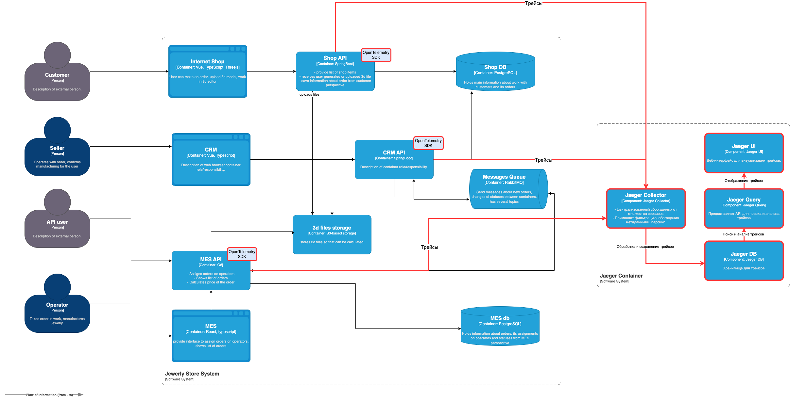

# Задание 3. Архитектурное решение по трейсингу

## Мотивация внедрения трейсинга

### Почему это важно для бизнеса?

В текущей системе мы часто возникает ситуация, когда заказ "теряется" где-то между онлайн-магазином, CRM и производством. Клиенты жалуются на задержки, менеджеры тратят часы на поиск информации, а инженеры не могут быстро определить причину проблемы. Трейсинг решит эти вопросы, предоставив полную видимость пути каждого заказа через все системы.

### Какие преимущества от внедрения трейсинга?

1. **Для клиентов:**
   - Прозрачность статуса заказа
   - Снижение времени ожидания
   - Меньше спорных ситуаций

2. **Для менеджеров:**
   - Мгновенный доступ к истории обработки любого заказа
   - Возможность давать точные прогнозы сроков
   - Снижение нагрузки на поддержку

3. **Для производства:**
   - Четкое понимание загрузки мощностей
   - Возможность балансировать очередь заказов
   - Данные для оптимизации процессов

4. **Для разработки:**
   - Конкретные данные для оптимизации вместо догадок
   - Быстрая диагностика проблем
   - Возможность измерять эффект от изменений

### Примеры

1. **Сценарий:** Клиент не получил заказ в обещанный срок
   **С трейсингом:** Видим, что заказ 5 дней пролежал на этапе подтверждения дизайна → оптимизируем процесс согласования

2. **Сценарий:** Производство простаивает
   **С трейсингом:** Обнаруживаем, что задержки в передаче данных из CRM → исправляем интеграцию

3. **Сценарий:** Повторяющиеся ошибки расчета стоимости
   **С трейсингом:** Видим проблемные 3D-модели определенного типа → дорабатываем валидатор

Трейсинг станет важным шагом в цифровой трансформации компании, позволяя перейти от работы "вслепую" к управлению на основе данных.

## Предлагаемое решение

Ссылка на решение - https://drive.google.com/file/d/14cHhd4H0EHFTgZEDHzN_IQzt181A5mST/view?usp=sharing

### 1. Технологический стек для трейсинга
- Jaeger - основной инструмент для сбора, хранения и визуализации трейсов
- OpenTelemetry - стандартизированная библиотека для инструментации кода

### 2. Необходимые доработки

| Компонент    | Технологии       | Что нужно сделать                              |
|--------------|------------------|-----------------------------------------------|
| Jaeger     | Jaeger Collector, Jaeger backend, Jaeger UI, Jaeger DB      | Добавить необходимые компоненты для запуска Jaeger |
| Shop API     | Spring Boot      | Добавить OpenTelemetry Starter, настроить трейсы для ключевых операций |
| CRM API      | Spring Boot      | Добавить OpenTelemetry Starter, настроить трейсы для ключевых операций     |
| MES API      | C#               | Внедрить OpenTelemetry .NET SDK               |
| RabbitMQ     | -                | Настроить пропагацию trace-id в заголовках сообщений |

## 3. Ключевые метрики для трейсинга

### Сквозное время выполнения заказа
- **Полный цикл**: от создания заказа до завершения производства
- **Детализация**:
  - Разбивка времени по каждому этапу процесса
  - Анализ задержек между этапами

### Задержки в интеграциях
- **CRM → MES через RabbitMQ**:
  - Время доставки сообщений
  - Очереди и задержки обработки
- **Внешние API**:
  - Время выполнения внешних вызовов
  - Таймауты и ошибки соединения

### Анализ ошибок
- **Распределение**:
  - Частота ошибок по компонентам системы
  - Классификация типов ошибок
- **Диагностика**:
  - Воспроизведение цепочек вызовов перед ошибкой
  - Анализ параметров запросов при ошибках

## 5. Этапы внедрения

### Пилотная фаза
- Инструментация MES API (приоритетный проблемный компонент)
- Развертывание Jaeger в dev-среде
- Базовый мониторинг критических операций

### Основное внедрение
- Полная инструментация всех бэкенд-сервисов
- Настройка сквозной трассировки через RabbitMQ:
  - Пропагация trace-id в заголовках сообщений
  - Корреляция сообщений между сервисами
- Настройка алертинга по ключевым метрикам

### Оптимизация (постоянный процесс)
- Настройка семплирования:
  - 100% трейсов для запросов с ошибками
  - 20% трейсов для успешных операций
- Оптимизация хранилища трейсов:
  - Настройка TTL (time-to-live) для данных
- Регулярный анализ и настройка параметров сбора метрик

## Когда трейсинг может оказаться неэффективным

### Системы с закрытыми API и проприетарным ПО
На практике можно сталкиваться с ситуациями, когда часть технологического стека использует закрытые коммерческие решения (например, системы класса ERP или устаревшие legacy-системы). В таких случаях внедрение сквозного трейсинга сталкивается с серьезными препятствиями. Проприетарные системы обычно не предоставляют возможностей для интеграции с современными инструментами мониторинга, а их модификация требует значительных инвестиций и согласований с вендорами.

### Высоконагруженные системы реального времени
Для приложений, где критически важна минимальная задержка (например, биржевые торговые платформы или системы обработки платежей), трейсинг может принести больше вреда, чем пользы. Каждый элемент трейса (span) добавляет дополнительную нагрузку:

- Задержка в 5-15 миллисекунд на каждый span
- Дополнительная нагрузка на CPU (10-20% ресурсов)
- Увеличение сетевого трафика

Именно поэтому в high-frequency trading (HFT) системах трейсинг часто сознательно не используют, предпочитая другие методы мониторинга.

### Проекты с ограниченным бюджетом
Для небольших проектов или стартапов стоимость внедрения и поддержки полноценной системы трейсинга может оказаться непропорционально высокой. Необходимо учитывать не только первоначальные затраты на интеграцию, но и постоянные расходы на обслуживание инфраструктуры.

## Возможные меры безопасности

### Безопасность доступа и передачи данных
Доступ к компонентам трейсинга (Jaeger UI, Collector, хранилище) разрешен только через корпоративный VPN с двухфакторной аутентификацией. Используется интеграция с ролевой моделью (RBAC), разграничивающая права администраторов, разработчиков и поддержки. Все внутренние коммуникации защищены TLS 1.2+, mTLS для агентов. Внешние запросы проходят через API Gateway с JWT-аутентификацией, квотами и изолированными tenant'ами.

### Мониторинг и предотвращение угроз
Система автоматически детектирует и блокирует аномалии: подозрительные запросы, несанкционированный доступ к чужим трейсам, попытки массового экспорта данных. Все операции логируются и интегрируются с SIEM, еженедельно формируются отчеты о подозрительных событиях.

### Управление данными и резервное копирование
Трейсы хранятся 7 дней (prod) или 24 часа (debug), затем автоматически удаляются. Резервные копии создаются ежедневно в зашифрованном виде и хранятся в изолированном сегменте 14 дней. Это обеспечивает баланс между доступностью данных и безопасностью.
