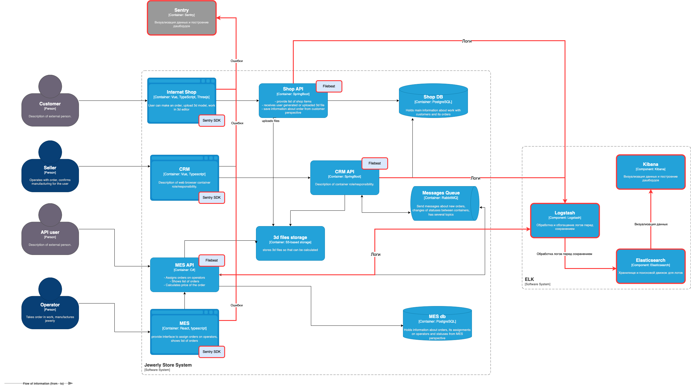

# Задание 4. Архитектурное решение по логированию

## Какие логи необходимо собирать

### 1. Логи изменения статуса заказа (INFO)
**Где:** CRM, MES, Shop API\
**Что логировать:**
- Время изменения статуса
- Идентификатор заказа
- Идентификатор пользователя (если есть)
- Предыдущий и новый статус
- Идентификатор оператора/продавца (если изменение инициировано им)

### 2. Логи расчёта стоимости заказа (INFO)
**Где:** MES API\
**Что логировать:**
- Время начала и окончания расчёта
- Идентификатор заказа
- Количество полигонов в 3D-модели
- Время выполнения (для анализа задержек)

### 3. Логи работы с API (INFO/WARN)
**Где:** MES API, Shop API\
**Что логировать:**
- Время запроса
- Метод (GET/POST/PUT)
- Endpoint
- Идентификатор заказа (если есть)
- Статус ответа (200, 400, 500)
- Время выполнения

### 4. Логи очереди сообщений (INFO/ERROR)
**Где:** RabbitMQ, CRM, MES\
**Что логировать:**
- Время отправки/получения сообщения
- Топик/очередь
- Содержание сообщения (или его ключевые параметры, например, ID заказа)
- Ошибки (если сообщение не доставлено)

### 5. Логи загрузки MES (INFO/WARN)
**Где:** MES (фронтенд и бэкенд)\
**Что логировать:**
- Время загрузки страницы
- Количество заказов в выборке
- Фильтры, применённые к дашборду
- Ошибки при загрузке данных

### 6. Логи работы с 3D-файлами (INFO/ERROR)
**Где:** Shop API, MES API, 3D files storage\
**Что логировать:**
- Время загрузки файла
- Размер файла
- Идентификатор заказа
- Ошибки обработки (например, невалидный формат)

### 7. Логи операций операторов (INFO)
**Где:** MES\
**Что логировать:**
- Действие оператора (взял заказ, завершил производство и т. д.)
- Идентификатор заказа
- Идентификатор оператора
- Время действия

### 8. Логи ошибок и критических событий (ERROR)
**Где:** Все системы\
**Что логировать:**
- Критические ошибки (падение сервиса, потеря данных)
- Ошибки интеграции (например, недоступность RabbitMQ)
- Ошибки валидации данных

### 9. Логи долгих операций (WARN)
**Где:** MES API, Shop API, CRM\
**Что логировать:**
- Операции, выполняющиеся дольше ожидаемого (например, расчёт стоимости >5 минут)
- Запросы к БД с большим временем выполнения

## Мотивация внедрения логирования
Внедрение комплексной системы логирования — это не просто техническое требование, а стратегическое решение, которое позволит компании:

1. **Быстрее обнаруживать и устранять инциденты** — сократит время простоя систем и потерю прибыли из-за технических сбоев
2. **Улучшить качество сервиса** — анализ логов поможет выявить узкие места в работе с клиентами (например, долгий расчёт стоимости или проблемы с загрузкой 3D-файлов)
3. **Оптимизировать затраты** — данные о времени выполнения операций позволят найти неэффективные процессы
4. **Повысить прозрачность** — логи дадут чёткую картину действий операторов и работы интеграций между системами
5. **Соблюдать compliance** — журналирование критических операций важно с точки зрения аудита и регулирования

**Ключевые метрики, которые улучшатся благодаря логированию:**
- Время восстановления сервиса (MTTR) при инцидентах
- Конверсия на этапе расчёта стоимости заказа
- Среднее время выполнения ключевых операций (например, обработки заказа)
- Количество ошибок интеграции между системами
- Удовлетворённость операторов работой с системой

### Приоритеты внедрения

Учитывая ограниченные ресурсы, рекомендуем начать с систем, которые наиболее критичны для бизнеса и клиентского опыта:

1. **MES API** — ядро производственных процессов, где происходят расчёт стоимости и управление статусами. Проблемы здесь напрямую влияют на выполнение заказов.
2. **Shop API** — точка входа клиентов. Логи помогут понять, почему пользователи не завершают заказы.
3. **RabbitMQ** — центральная "артерия" для сообщений между системами. Сбои здесь парализуют весь workflow.

Эти три компонента образуют минимально жизнеспособный контур логирования, который уже даст 80% пользы. CRM и фронтенд MES можно подключить на втором этапе — они важны, но их проблемы менее критичны для непрерывности бизнеса.

## Предлагаемое решение

Ссылка на решение - https://drive.google.com/file/d/14cHhd4H0EHFTgZEDHzN_IQzt181A5mST/view?usp=sharing

### Ключевые компоненты

1. **Elasticsearch**
   - Хранилище и поисковый движок для логов
   - Требует настройки индексов по типам логов (orders, api, errors и т.д.)
   - Отдельный кластер для production

2. **Logstash**
   - Обработка и обогащение логов перед сохранением
   - Конвейеры для:
     - Парсинга структурированных логов
     - Добавления metadata (сервис-источник, окружение)
     - Фильтрации чувствительных данных

3. **Filebeat**
   - Агенты на каждом сервере для сбора:
     - Файловые логи приложений
     - Systemd journal (для сервисов)
   - Поддержка backpressure при перегрузке

4. **Kibana**
   - Дашборды для:
     - Мониторинга ошибок в реальном времени
     - Анализа производительности API
     - Трендов по бизнес-событиям

5. **Sentry** (Мониторинг ошибок фронтенда)
   - Интеграция с React/Vue приложениями
   - Сбор:
    - JavaScript-ошибок
    - Ошибок API-запросов
    - Производительности рендеринга

### Типовой конвеер сбора логов

#### Сбор логов с помощью Filebeat

##### Конфигурация Filebeat
Filebeat будет развернут на всех серверах с приложениями для сбора следующих данных:

1. **Файловые логи приложений**
   - Мониторинг лог-файлов в стандартных директориях (/var/log)
   - Поддержка ротации логов (logrotate)

2. **Systemd journal**
   - Сбор логов системных сервисов
   - Фильтрация по юнитам

3. **Отправка в Logstash/Kafka**
   - Настройка выходного конфига

##### Особенности работы
- **Гарантированная доставка**: Filebeat сохраняет состояние (registry file) и возобновляет отправку с места остановки
- **Backpressure**: автоматическое снижение нагрузки при переполнении Logstash
- **Мультилайн-логи**: корректная обработка stacktrace'ов и многострочных сообщений

#### Обработка и обогащение c помощью Logstash

Logstash-конвейер будет включать:

1. **Фильтрацию PII-данных** (эмайлы, телефоны)
   - Использование fingerprint-фильтра для анонимизации
   - Удаление чувствительных полей через mutate

2. **Нормализацию timestamp**
   - Приведение всех временных меток к UTC
   - Парсинг различных форматов дат

3. **Добавление geo-информации** по IP (для фронтенд-логов)
   - Использование GeoIP-фильтра
   - Обогащение location-данными

4. **Классификацию ошибок** по типам
   - Группировка по кодам ошибок
   - Добавление severity-уровней

#### Визуализация

Примеры дашбордов в Kibana:

##### Технические метрики
- **Карта ошибок** по сервисам
- **95-й перцентиль** времени ответа API
- **Частота событий** RabbitMQ

##### Бизнес-метрики
- **Воронка смены статусов** заказов
- **Среднее время расчета** стоимости
- **География заказов** с ошибками 3D-файлов

#### Особенности для разных систем

##### MES API
- Отдельный индекс для логов расчетов
- Алерты на долгие операции (>5 мин)
- Связь с метриками Prometheus через exemplars

##### Shop API
- Логирование полного цикла заказа
- Выделение сессий пользователей
- Интеграция с фронтенд-логами (Sentry)

#### Безопасность
1. RBAC в Kibana (разделение доступа по командам)
2. Шифрование данных в transit (TLS между компонентами)
3. Отдельные пользователи для записи и чтения
4. Политики хранения (например, логи ошибок — 1 год, access logs — 1 месяц)

## Настройка алертинга и обнаружение аномалий
Для оперативного реагирования на нештатные ситуации в системе можно реализовать многоуровневый механизм алертинга. На первом уровне используются простые пороговые правила в Kibana Alerting и Sentry - например, уведомление при резком росте 5xx ошибок или при появлении критических исключений. Эти правила основаны на статических значениях (более 10 ошибок в минуту) и срабатывают мгновенно, позволяя быстро реагировать на очевидные проблемы. Для более сложных сценариев, таких как неожиданный рост числа заказов или аномальная активность API, применяется машинное обучение через Elastic ML. Система анализирует исторические данные и автоматически определяет отклонения от нормальных паттернов - например, если обычно создается 4-5 заказов в секунду, а внезапно их число возрастает до 10 000, что может указывать на DDoS-атаку или технические неполадки.

Обнаруженные аномалии проходят многоступенчатую фильтрацию, чтобы исключить ложные срабатывания. Сначала система проверяет корреляцию с запланированными маркетинговыми акциями или техническими работами, затем анализирует географию запросов и паттерны поведения. Только после этого ответственные команды получают уведомления через заранее определенные каналы - критичные инциденты идут в PagerDuty с высоким приоритетом, менее срочные проблемы попадают в Slack-канал мониторинга. Для каждого типа алерта заранее подготовлены playbook с инструкциями по первичному анализу и возможными способами mitigation, что позволяет инженерам оперативно реагировать даже на незнакомые ранее инциденты.
